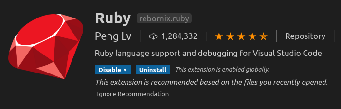

Build the code for development
```
kudu build -d -n zapt
kudu build -d -n zapt -o
```

Install these gems
```
> gem list ruby
debase-ruby_core_source (0.10.9)
ruby-debug-ide (0.7.2, 0.6.1)
```

Install the vscode extension

  

